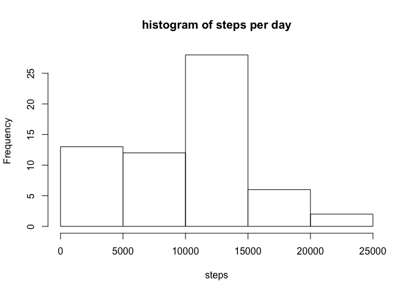
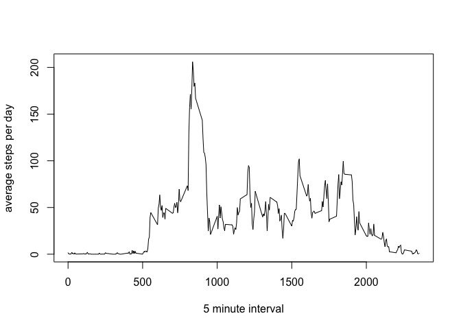

# Reproducible Research: Peer Assessment 1


## Loading and preprocessing the data

```r
activities<-read.csv('activity.csv')
```

## What is mean total number of steps taken per day?

```r
library(dplyr)
by_day<-group_by(activities, date)
steps_by_day<-summarize(by_day, steps = sum(steps, na.rm = T))
hist(steps_by_day$steps, main = 'histogram of steps per day', xlab = 'steps')
```

 

```r
mean(steps_by_day$steps, na.rm = T)
```

```
## [1] 9354.23
```

```r
median(steps_by_day$steps, na.rm = T)
```

```
## [1] 10395
```
## What is the average daily activity pattern?

```r
by_interval<-group_by(activities, interval)
steps_by_interval<-summarize(by_interval, steps = mean(steps, na.rm = T))
plot(steps_by_interval$interval, steps_by_interval$steps, type = 'l', xlab = '5 minute interval', ylab = 'average steps per day')
```

 

The 5 minute interval with the maximum number of steps (averaged over all days)

```r
steps_by_interval[steps_by_interval$steps==max(steps_by_interval$steps),]$interval
```

```
## [1] 835
```

## Imputing missing values


## Are there differences in activity patterns between weekdays and weekends?
